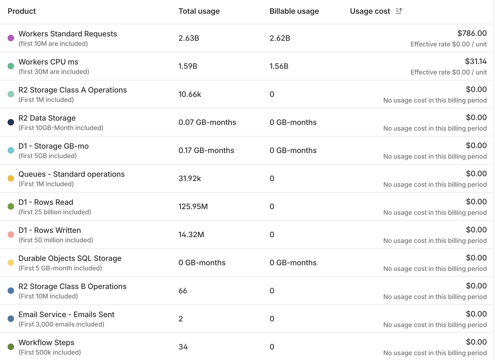
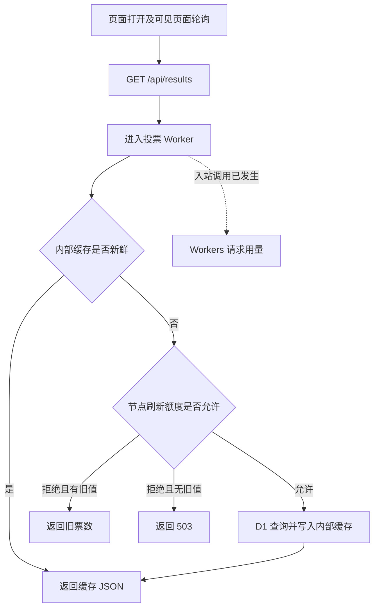
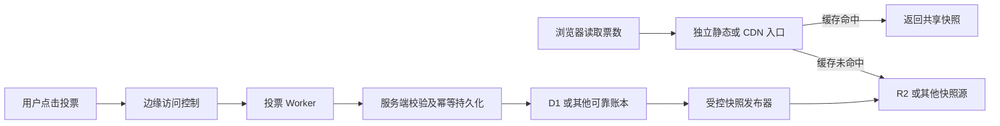

# 一个投票站收到 26 亿次请求之后：AI 编程、Cloudflare 缓存与计费的事故复盘

2026 年 10 月 4 日，我检查一个单页投票站的 Cloudflare 用量，读到了 **$816.52 的累计用量费用**。其中 **$785.40 是 Workers 请求费，占 96.19%**；CPU 费用只有 $31.12。

这次账单问题最终被我注意到，靠的是连接了邮箱的 **dots 主动检索邮件**。据我的实际收件经历，Gmail 只收到过一次 **$10 阈值的账单告警**，后续再也没有收到其他账单告警。后面会结合截图解释：为什么“有一封提醒邮件”仍然不足以保护账单。

站点的页面很简单：两张图、两个投票按钮、一条显示左右票数的进度条。用户可以投票，页面持续更新结果。系统加过人机校验、投票限流、数据库缓存和失败退避，也有通过的本地测试。可是，这些措施没有让请求账单受到控制。

这篇文章复盘的是：**一个业务上看似很轻的应用，如何因为公开读取路径和计费边界的错位，积累了数十亿次动态调用。**它也记录 AI 编程助手在这个过程中做过什么、遗漏了什么，以及独立开发者怎样把“能运行”推进到“成本可控地运行”。

先把证据边界说清楚：本文事实截至北京时间 **2026 年 10 月 4 日**。$816.52 是账号在 **9 月 11 日至 10 月 10 日账期**内，当时已经显示的累计用量费，**不是本文已经核实的最终发票或实际扣款**。请求数不是访客数；现有材料也不能证明所有请求都是恶意的，或者把整张费用归给某个 IP。公开数据经过白名单筛选和脱敏，见 [案例数字](../evidence/case-facts.json) 和 [证据说明及公开执行记录](../evidence/case-notes.md)。

## 1. 起点：我要求的是一个实时投票页面

最初的需求并没有指定 Cloudflare。它要求一个极简、适配手机和电脑的单页投票站，实时展示左右票数，并部署到 GitHub Pages。

下面是最初提示词的节选，省略了图片、署名及排版细节：

> 制作一个只有一个页面的投票站，站点极简，同时适配移动端和电脑端。实时展示当前投票结果。挂到我的 github.io 上。

GitHub Pages 可以托管静态页面，但全体用户共享的投票结果需要有地方保存和更新。助手给出的实现增加了 Worker API 和 D1 数据库。随后我注册了自定义域名，站点逐步迁到 Cloudflare，原 GitHub Pages 入口也关闭了。

这里已经发生了一次重要的需求转换：从“托管一个网页”变成了“运营一个公开的动态服务”。页面复杂度没有明显增加，费用风险却变了。**这一步需要重新确认实时性、流量模型和预算，而不能只把域名配通。**

我很早就问过：

> 如果访问量巨大，我的账单会爆炸吗？

会话记录显示，助手当时解释过 Workers 请求的超额单价、轮询放大，以及单次 50 ms CPU 上限不等于月账单硬上限。不能把历史改写成“从来没有提醒计费”或者“承诺无限免费”。真正没有完成的是，把这个提醒落实成预算、前置保护、异常响应和上线验收。

## 2. 这笔费用究竟是什么

调查使用了当日控制台、域名 Analytics、Worker 指标和抽样日志、本地代码、Git 历史，以及公开会话中的执行结果。它们的统计窗口和对象不同，不能直接互相替代。

| 指标 | 截至调查时读到的数值 | 口径 |
|---|---:|---|
| 账号 Workers 请求 | 约 26.3 亿次 | 9/11–10/10 账期，截至 10/4；界面舍入值 |
| 投票 Worker 调用 | 约 26.1 亿次 | 近 7 天，指定服务；界面舍入值 |
| Zone HTTP 请求 | 2,677,103,137 次 | 9/27 08:00–10/4 08:00，包含子域名 |
| Workers 请求用量费 | $785.40 | 账号账期用量费，96.19% |
| Workers CPU 用量费 | $31.12 | 账号账期用量费，3.81% |
| 用量费合计 | **$816.52** | 累计用量，不等于已确认扣款 |
| 已显示的 D1 超额用量费 | $0 | 不代表数据库没有过载过 |

本次补充的用量截图显示，Workers 请求费为 **$786.00**，CPU 费用为 **$31.14**，两项合计 **$817.14**。这里保留上表最初调查时的 $816.52，并把新图作为另一份观测记录；截图没有提供拍摄时间和完整账期，不能据此精确还原两次观测的先后或差额发生时间。两份材料都不等于已核实的最终扣款。



*图 1：项目所有者提供的用量费用截图，原图保留。已展示条目中，请求费与 CPU 费合计 $817.14；总用量和可计费用量为界面舍入值。*

Workers Standard 在核验时的请求超额价为每百万次 $0.30，CPU 超额价为每百万 CPU 毫秒 $0.02。官方价格按账号月度包含额度计算，另外有最低订阅费用；不能给每个 Worker 各减一份包含额度。[Workers 官方定价](https://developers.cloudflare.com/workers/platform/pricing/)

仅按请求费反推：

```text
$785.40 ÷ $0.30 × 1,000,000
= 2,618,000,000 次超额请求
```

这与控制台舍入后的超额用量一致。费用主因已经很明确：**极端数量的请求调用**。并不需要假设一条 SQL 特别昂贵，也不是因为 HTTP 返回的 JSON 很大。

域名统计中的流量高峰集中在三个窗口：

| 北京时间窗口 | Zone HTTP 请求数 | 全天平均请求/秒 |
|---|---:|---:|
| 9/27 08:00–9/28 08:00 | 4,755,212 | 55.04 |
| 9/28 08:00–9/29 08:00 | 797,131,326 | 9,226.06 |
| 9/29 08:00–9/30 08:00 | 1,118,612,190 | 12,946.90 |
| 9/30 08:00–10/1 08:00 | 690,714,081 | 7,994.38 |
| 10/1 08:00–10/2 08:00 | 18,327,112 | 212.12 |
| 10/2 08:00–10/3 08:00 | 177,875 | 2.06 |
| 10/3 08:00–10/4 08:00 | 47,385,341 | 548.44 |

中间三个高峰窗口占这份 7 天 Zone 请求的 **97.36%**。这里的日界线是北京时间 08:00，不是本地自然日。它们支持“异常请求规模值得调查”，却不能直接回答这些请求分别来自机器人、正常轮询、监控脚本还是其他来源。

同样，原始 PV、唯一 IP 参考值不能直接变成广告商看到的“真人曝光”。一次费用事故也可能把运营报表冲得很好看。没有净化和口径说明的数据，不能用来证明广告价值。

## 3. 出了两次问题：异常票，和异常请求费用

第一次问题是业务防重不足。初版在浏览器 localStorage 中保存随机 UUID，数据库保证每个 UUID 只投一票。问题在于：UUID 是客户端能够更换的标识。换一个 UUID，就能以新身份继续投。

9 月 27 日早上，历史统计记录了 **4,559,229 票**。同时，D1 实际返回过 `7429: D1 DB is overloaded. Requests queued for too long.`。这是有证据的业务漏洞和容量故障。

之后加入服务端 Turnstile、投票限流、结果缓存和前端退避，旧票也按用户后来确认的口径归档。现有代码中的人机校验并不是只显示一个前端组件：它会调用 Siteverify，检查 `success`、`hostname`、`action` 和用户标识；缺少配置、令牌或验证失败时，不写入新票。这符合必须在服务端验证令牌的方向。[Turnstile 服务端校验](https://developers.cloudflare.com/turnstile/get-started/server-side-validation/)

第二次问题发生在费用边界。**投票不能通过，结果读取仍然可以持续发生。**即便没有新增票、没有执行 SQL、程序只返回缓存或拒绝响应，也不能据此认定没有 Worker 入站请求用量。

早期异常票主要发生在 9 月 27 日上午，请求费用的主要流量高峰则出现在 9 月 28 日至 30 日。两者存在关联风险，但不是同一个指标。清理票数无法撤销已经发生的调用费用。

## 4. 为什么“已经有缓存”仍然没有解决账单

事故版本的主要读取路径如下。图中标的是本案例的应用逻辑，不能用它代替其他 Cloudflare 配置的执行顺序。



可以用一段简化代码理解它。下面是逻辑示意，不是原源码的逐字摘录，也不是可直接部署的修复补丁：

```js
async function readResults(url, env) {
  // 运行到这里，请求已经进入 Worker。
  const key = new Request(`${url.origin}/__public_totals_vX`);
  const cached = await caches.default.match(key);

  if (cached && isFresh(cached, 10_000)) {
    return publicJson(await cached.json()); // 不查询 D1。
  }

  // 这个额度限制刷新数据库的次数，不限制所有入站调用。
  const allowed = await env.RESULTS_REFRESH.limit({ key: "totals" });
  if (!allowed.success) return staleOrUnavailable(cached);
  return refreshFromDatabase(env);
}
```

缓存帮助数据库减压，但每个读取请求仍会先进入 Worker。`caches.default` 的缓存内容也不会自动复制到其他数据中心；一个固定键不等于全球共享的一次刷新或一把锁。[Cache API 官方说明](https://developers.cloudflare.com/workers/runtime-apis/cache/)

这里还容易混淆三个不同的“缓存”：

| 缓存的位置 | 能减少什么 | 仍需核对什么 |
|---|---|---|
| Worker 内部 Cache API | SQL、部分 CPU 和等待 | Worker 入站调用仍发生 |
| 平台 Workers Cache | 命中时可以减少脚本执行 | 官方仍按标准 Worker 请求价计量 |
| 不经过该 Worker 的静态/CDN 路径 | 可以避免这个 Worker 的入站调用 | 静态服务、回源及存储操作费用 |

尤其要注意第二种：当前 Workers Cache 文档和价格说明明确保留命中请求的请求计费。把第一种换成第二种，可以优化执行成本，却不能据此宣布读取费用归零。[Workers Cache](https://developers.cloudflare.com/workers/cache/)

本案例对外结果响应还使用了 `Cache-Control: no-store`，前端 `fetch` 也选择 `no-store`。内部缓存中的一天 TTL 是保留旧值用于降级；10 秒新鲜窗口控制数据库刷新。这几个配置控制的是不同层，不能合并成“外部 CDN 每 10 秒只回源一次”。

也不能因此说“Cloudflare CDN 失效了”。静态页面和公开动态 API 是不同路径：页面可以由 CDN 正常分发，API 仍由 Worker 执行。问题是选错了高频共享数据的交付路径。

## 5. 轮询会把一个小页面放大到什么程度

初版每 3 秒读取一次结果；保护版改为成功后约 5 秒再读取。后者使用串行调度，失败时按 10、20、40、60 秒退避，并在页面隐藏时暂停。审计没有发现单页零间隔死循环，不能把所有异常请求归因于“前端无限循环”。

但正常轮询本身就是一个确定的放大系数：

```text
结果请求 ≈ 页面打开时首次读取
         + 可见停留秒数 ÷ 轮询间隔
         + 恢复可见、投票等事件触发的读取
```

一个持续可见的页面按 5 秒间隔读取，一天约 **17,280 次**。它持续在线 30 天，约 **518,400 次**。如果只是用户打开页面看了几秒，请求很少；如果有很多页面长期停留、多标签页或脚本直接读取接口，调用会不断积累。

以下只是正常轮询的模型，不是本案例的真实访客数。假设 30 天持续可见、所有结果读取都计 Worker 请求量、账号的 1,000 万次包含额度全部可分给这里，只算请求超额费：

| 持续可见页面数 | 30 天结果请求 | 请求超额费模型 |
|---|---:|---:|
| 10 | 5,184,000 | $0 |
| 100 | 51,840,000 | $12.55 |
| 1,000 | 518,400,000 | $152.52 |
| 5,000 | 2,592,000,000 | $774.60 |

这个模型的意义不是用“5,000 个页面”解释本次所有流量，而是在选型时就让“实时更新”有一个成本单位。轮询改慢能减少遵守前端逻辑的请求；直接打接口的程序没有义务遵守我们的间隔和退避。

## 6. 防刷和费用防护，保护的对象不一样

人机校验保护写入资格；UUID 去重保护同一标识不重复计票；IP 规则限制一个出口能成功写入多少票；缓存保护数据库。这些都有价值，但它们没有自动保护账号总调用量。

本案例后来增加了滚动一小时 10 票的数据库规则：第 11 张新票被拒绝，并写入持久封禁名单。封禁用于新投票，不覆盖公共结果 GET。“一小时”是观察窗口，不是封禁一小时后自动解封。新 IP 字段从 **9 月 30 日 20:30:46** 起实际记录，之前缺少 IP 的票无法通过后来加字段追溯。

即便每个页面打开时先弹验证码，如果只在前端挡住页面，脚本仍能跳过页面去请求 API。若验证放在 Worker 内，失败请求也已经进入了程序。需要保护费用入口时，应核对边缘规则、挑战和限流的实际处理层级；终止型安全动作会停止后续处理，但必须对具体路由和入口验证。[WAF 阶段说明](https://developers.cloudflare.com/waf/feature-interoperability/)

验收不能只看“得到一个 403”。同一个状态码可能来自边缘，也可能来自 Worker 自己。应对照测试窗口、边缘规则事件和 Worker invocations，确认被拦请求没有进入目标收费程序。

还有旁路入口：主域名、默认域名、预览链接、dev 和备用域名必须分别列出。本案例绑定主站之后一度仍保留默认入口；主站的 Zone 规则不能被假定自然覆盖其他域名。测试服务还配置过 `run_worker_first`，意味着静态文件也可能先执行 Worker。平台允许直接静态服务，不代表所有“最后返回静态文件”的实现都走同一计费路径。[Static Assets 计费及限制](https://developers.cloudflare.com/workers/static-assets/billing-and-limitations/)

## 7. 公开时间线：我们知道风险，却没有完成控制

下表是脱敏执行记录摘要，时间均为北京时间。它只保留与事故有关的请求、动作和读回结果，不复制密钥、登录参数、原始 IP、身份资料或完整工具输入。

| 时间 | 用户需求或发现 | 公开执行结果与边界 |
|---|---|---|
| 9/27 00:42 | 创建实时单页投票站、先挂 GitHub Pages | 引入 Worker + D1 后端；初版 UUID 去重、3 秒轮询 |
| 9/27 00:55–00:57 | 询问巨大访问量是否会产生高费用 | 解释请求单价和轮询；设置单次 CPU 限制；未完成总费用控制 |
| 9/27 09:59–10:07 | 四百多万票、结果读取经常失败 | 查到 UUID 漏洞与 D1 过载；部署校验、缓存、限流及退避 |
| 9/27 22:29–22:37 | 确认从人机校验上线后开始计票 | 旧票归档，展示计票口径切换并读回；请求费用不撤销 |
| 9/28 11:18 | 为广告合作获取真实访问数据 | 已发现百万请求和程序化征兆；没有记录费用防护闭环上线 |
| 9/30 16:04–20:30 | 保存 IP，一小时超十票封禁 | 本地准备及测试，授权曾阻塞；到 20:30:46 生产新票才开始记录 |
| 10/4 16:53–17:01 | 查询流量和 Worker 账单 | 读到约 26.1 亿投票 Worker 调用，以及 $816.52 账号用量费 |
| 10/4 17:06 后 | 要求停服 | 生产路由、默认和预览入口关闭，回读主站/API 403、默认入口 404；当时 dev 未完全移除 |

原会话中，几个关键提示词很直接：

> 今天一晚上过去已经 400 多万票了，是不是有刷票的，加个护栏吧，然后老是暂时无法获取票数。你修一下这个问题。

> 你先做一个根据 IP 地址的刷票行为 block，一小时之内刷了 10 张票以上的 IP 直接封掉。然后再检查一下人机校验有没有生效。

> 结合代码，账单，日志，给我输出一个长文报告，关于为什么我这个月账单这么贵，bug 原因，如何改进……给我一个事故报告。

对应的公开执行记录不是一条“助手说已完成”就结束了。可以确认的动作包括：D1 错误读回、部署返回、归档后结果读回、IP 字段上线后的数据库读回，以及停服后的 HTTP 回读。需要区分的状态也保留下来：**本地准备、已提交、部署受阻、已部署、线上验证**。其中某一步成功，不能自动填满其他步骤。

调查时，本地工作区还存在未提交修改；线上版本标识也没有与唯一 commit 完全对齐。这使后来精确还原线上行为更困难。功能测试在当前工作区通过，并不证明高峰期部署了同样的代码。

## 8. 责任应该落在哪里

“第一个 prompt 没写 Cloudflare”不是合理归因。最初已经说明部署到 GitHub Pages，也要求全局共享实时结果。引入动态后端、之后迁到 Cloudflare，都属于需要重新评估成本的架构决定。

用户不需要预先知道“Worker 缓存命中仍计调用”，才能提出一个普通投票站需求。AI 编程助手有责任补齐影响选型的约束，解释代价，并把识别到的风险落实成可验证的控制。用户后来迭代广告、支付或布局，也不能成为费用防护没有完成的理由。

助手做过有效工作：解释过费用，发现并修复了初版防重问题，部署过服务端人机校验与数据库降载措施，保留了归档记录，最终也执行了停服和读回。

但这些工作留下了几项明确缺口：

- 提醒了按调用收费，却没有确定可以接受的日/月预算和响应阈值。
- 修复了计票与数据库压力，没有同时验收公共读取的费用边界。
- 发现异常流量后，没有将 Analytics 报告及时转成费用事故响应。
- 没有完成全部入口的收费前拦截和降级演练。
- 没有持续绑定源码、commit、Worker 版本和验收窗口。

### 全局账单告警：一次 $10 邮件没有形成持续响应

**一定要做好全局账单报警。**单次调用的 CPU 限额、某个 Worker 的请求量提醒、某种存储的用量提醒，都只覆盖一部分风险。运营者需要看到整个账号跨产品累计产生了多少费用，以及它正在以多快的速度增长。

这次并不是完全没有配置告警。下面的截图显示，账号有一条自动创建的默认预算告警，阈值是 **$10**，配置了一个接收者；面板显示的用量支出已达到 **$817.14**，约为预算的 **81.7 倍**，界面标记为 **8171%、Over budget**。**$10 是提醒阈值，不是费用上限。**


*图 2：项目所有者提供的预算告警截图。面板写有「Oct 2026」，但这张图没有展示完整账期和拍摄时间；不能用这个月份标签替换前文已经核对的账期。*

我的实际经历是：**Gmail 只收到了一次 $10 阈值的账单告警，之后没有再收到其他账单告警。直到连接了邮箱的 dots 通过主动检索邮件发现这个问题，我才注意到异常账单。**这是我对收件和发现过程的补充陈述；本公开包没有独立核验原始邮件及投递日志。截图能证明告警配置和超预算状态，不能单独证明邮件发送次数、投递时间或送达情况。

这里有一个容易误解的平台机制：Cloudflare 官方文档说明，Budget Alerts 汇总账号各类按用量收费产品的支出，在当前账期跨过指定金额时发送**一次邮件**，下个账期重置。它不会因为费用从 $10 继续涨到 $100、$500、$800，就自动把同一条提醒反复发送；也不会自动暂停服务或封顶。因此，只有一封收到的邮件，与这个机制相容，不能直接认定为后续邮件丢失或平台故障。[Cloudflare 预算告警说明](https://developers.cloudflare.com/billing/manage/budget-alerts/)

这个账号级提醒覆盖的是用量费用，不包含 Workers Paid 等固定订阅费用；官方还说明，用量按天处理，提醒会滞后于实际活动。**要监控完整账单，还应把固定费用纳入总预算，不能把原生 Budget Alerts 当成实时、覆盖全部费用的硬上限。**[默认预算告警及其范围](https://developers.cloudflare.com/changelog/post/2026-06-15-budget-alerts-default-on/)

这件事应该落成几条具体要求：

1. **先有账号级总预算，再有产品分项监控。**全局聚合 Workers、D1、R2、DO 等用量费用，另外核对固定订阅等费用，避免各个产品单看都不显眼，合起来却已经超支。
2. **设置多级阈值，并主动复查。**按可承担预算设预警、严重、停服处理线；原生告警按账期只触发一次，持续催办、每日摘要及费用增长速率监控需要另行实现和验收。费用一次跨过多条线时，也不能依赖必然收到多封邮件。
3. **验证提醒真的能到人。**核对接收者、垃圾邮件和通知规则，演练收到告警后的确认、升级与处置。单人在运营，也要明确谁来处理、多久必须响应。
4. **独立巡检账单和请求指标。**连接邮箱的 dots 这次通过主动检索发现了问题，这是有效的补救；日常还应主动查看账号费用和各产品增长趋势，避免费用监控只依赖同一封告警邮件。
5. **把报警接到降级或停服流程。**提前准备降频、只读快照、收费前拦截和撤销入口等动作，核对权限与传播延迟。已经产生的用量、统计延迟和在途请求仍可能继续反映到费用里。

这次真正缺的是持续监测和响应闭环。CPU 上限、操作限流、账号账单告警和撤销路由分别控制不同对象，不能彼此替代；控制台已经红了，也不代表服务已经停止产生费用。

## 9. 一个适合本业务的改进方向

左右票数对所有人基本相同，不需要每个访客的每次读取都执行数据库逻辑。可以让受控发布器读取可靠的投票数据，生成一个固定路径的快照；用户读快照，用户投票时才访问动态写入接口。



**这是改进方案，不是本文宣称已经线上验证通过的修复。**同仓库模板提供本地示例，真正部署后还要验证路由、缓存、配额和费用指标。

对这个投票业务，有几条不能省略的约束：

1. **先可靠记票，再反馈成功。**可以批量发布公开快照，不能先把票攒在普通 Worker 内存里、向用户承诺成功，再期待它一定会刷到数据库。
2. **公开快照与个人状态分开。**用户是否已投票、个人标识、支付状态不能混进所有人共享的缓存对象。
3. **快照读取不经过投票 Worker。**若选择 R2，使用明确的自定义域名和缓存规则；读取仍由 Worker 转发时，Worker 入站成本仍在。
4. **允许有限延迟，并解释旧值。**发布间隔、CDN TTL、浏览器轮询共同影响可见延迟；发布失败时显示带时间戳的旧快照。
5. **发布器要避免旧写覆盖新写。**固定对象名可以反复覆盖，不需要每个版本都保留一个对象；但单发布者、序列化和失败恢复需要有实现与测试。

R2 自定义域名支持 Cloudflare 缓存，但 JSON 不能被想当然地认为默认可缓存；需要明确配置，并考虑分层缓存减少回源。R2 自身不执行 SQL，也不会替 CDN 判断业务版本。[R2 公共桶与缓存](https://developers.cloudflare.com/r2/buckets/public-buckets/)

TTL 的工作方式通常是缓存到期之后由下一次请求触发刷新，而不是所有节点每隔十秒主动来拿一次。用短 TTL 和一个持续覆盖的对象，可以得到有限陈旧的快照；它不是每次读都强一致的数据库视图。

我们讨论过“15 秒发布、10 秒缓存”的方案，但发布调度要选对机制。Workers Cron 使用分钟级表达式；需要秒级调度时要另选例如 DO alarm，并考虑其可靠性和成本。[Cron Triggers](https://developers.cloudflare.com/workers/configuration/cron-triggers/)、[Durable Objects alarms](https://developers.cloudflare.com/durable-objects/api/alarms/)

DO 也不是自动免费的全球内存缓存。它有自己的请求、活动时长和存储计费，调用它的 Worker 还可能有自己的费用。真正需要实时推送时，可以评估 DO/WebSocket；若几十秒或分钟级更新已足够，也可以用更简单的发布器。架构应由业务延迟和成本决定。[DO 官方定价](https://developers.cloudflare.com/durable-objects/platform/pricing/)

## 10. 换成 CDN/R2，会省多少钱

按相同 **26.1 亿次公开 GET**做模型，而不把 7 天数字外推成整月：使用 R2 Standard，假设当月读取免费额度全部可用，每次实际回源对应一个 Class B 操作，结果如下。

| 最终没有到 R2 的读取比例 | R2 回源操作 | R2 读取超额费 |
|---|---:|---:|
| 99.9% | 2,610,000 | $0 |
| 99.5% | 13,050,000 | $1.44 |
| 99% | 26,100,000 | $6.12 |
| 95% | 130,500,000 | $43.56 |
| 0%，缓存完全失效 | 2,610,000,000 | **$936** |

R2 每月包含 1,000 万次读取，超额每百万次 $0.36；超出额度后的操作数按计费单位向上取整。因此 99% 那一行是 $6.12。表中比例包含分层缓存消化的请求，不等于某个浏览器看到的单一 `CF-Cache-Status` 命中率。[R2 官方定价](https://developers.cloudflare.com/r2/pricing/)

快照如果每 15 秒覆盖一次，30 天约 172,800 次写入，小于 100 万次月度写入包含额度；存储量也很小。但投票 POST、D1、发布器、订阅和其他服务费用仍要分别计算。这不是“整个网站永远零成本”的承诺。

更重要的反例就在表里：**缓存没生效，R2 单纯读取费用可能比原来的 Worker 请求模型还高。**迁移存储不是成本安全证明，实际回源操作数才是证据。旧 Worker 的内部缓存命中率也不能拿来当新 CDN 架构的预期命中率。

## 11. 怎样把教训写成可执行的上线验收

一个独立开发者不需要先变成 Cloudflare 专家，但应该能要求工具和助手交付下面这些东西：

| 验收项 | 需要看到的证据 | 不能替代它的东西 |
|---|---|---|
| 每个请求在哪里计费 | 路径图、路由配置、产品费用维度 | 页面看起来很轻 |
| 正常流量成本 | 停留时长、轮询、标签页和账户共享额度模型 | 只报“单次很便宜” |
| 异常流量成本 | 峰值请求预算、统计/响应延迟和降级机制 | 只设 CPU 上限 |
| 缓存解决了哪项费用 | Worker 调用、数据库操作、回源分别对照 | 一个很高的命中率 |
| 读取不经过动态 Worker | 受控请求窗口与目标 Worker 指标 | JSON 返回 200 |
| 边缘拦截确实生效 | 规则事件、被拦样本与 Worker 调用对照 | Worker 返回 403/429 |
| 全局账单告警能用 | 账号跨产品费用、分级阈值、实际送达、主动复查、负责人和处置演练 | 单次调用限制、分项提醒或控制台有一条配置 |
| 所有入口受控 | 主站、默认、预览、dev、备用域名清单 | 主域名测试成功 |
| 发布可以复查 | commit、构建哈希、部署版本、时间及读回 | 本地测试通过 |
| 停服范围明确 | 各入口关闭读回、后续新增用量观察 | 仅改了一份配置 |

测试应该用受控小样本和清晰窗口完成，不能为了证明安全，再向线上制造一次昂贵的洪泛。监测和统计存在延迟；自动撤销路由也存在传播时间。没有经证明的平台硬封顶能力，就明确写“告警与降级保护”，不要叫绝对月费硬上限。

我现在会把下面这段要求加到项目启动说明里。它不是把责任全推回提示词，而是给开发者一个能检查交付的工具：

> 涉及公开接口、轮询、推送或云服务选型时，先说明请求、计算、存储和日志怎么计费，给出正常与异常流量成本模型。缓存验收必须区分减少程序调用、减少 SQL 和减少回源。列出全部公开入口，验证异常请求在目标收费程序之前被阻止。做好账号级全局账单报警，明确覆盖的费用、分级阈值、送达验证、主动巡检、负责人、降级机制和延迟。每次交付分别列出本地完成、已提交、已部署、线上验证，以及仍未完成的部分。

同仓库的 skill 把这段要求展开成审查流程；AGENTS.md 提供短规则；项目模板给一个可以本地验证的读写分离示例。它们不能替部署后的费用观察，也不能保证每个业务都应使用 R2 或 DO。

## 12. 这次事故真正留下的东西

这不是“Cloudflare 不能做投票”的证据。Cloudflare 有可用的静态分发、动态计算、数据和安全能力；关键在于哪些请求走哪条路径，以及服务按什么单位收费。

这次最重要的拆分，是把 **业务防刷、服务容量、费用控制**当成三个独立目标。验证码不能替调用预算签字；缓存不能替费用保护签字；29 项本地测试通过，也不能替线上收费边界签字。

对使用 AI 编程的独立开发者，还有一条更直接的教训：要求助手同时交付功能模型和成本模型。它应该知道什么时候需要问预算、什么时候该核对官方计费，以及什么时候一个“修好了”的功能还没有通过运营验收。

截至本文证据截止时，生产服务已执行停服，但最终账单、全部测试入口的持续状态和跨日新增费用仍需另外核对。改进架构和同仓库模板属于方案及本地实现，本文没有把它们写成已经在原站线上修复成功。保留这个区别，是为了让下一位开发者拿到的是可复核的教训，而不是又一个“应该没问题”的承诺。

---

公开证据与口径：[case-facts.json](../evidence/case-facts.json)、[case-notes.md](../evidence/case-notes.md)。官方资料核验日期：2026-10-04。价格、套餐权益及产品能力会变化，部署前应重新核对。
