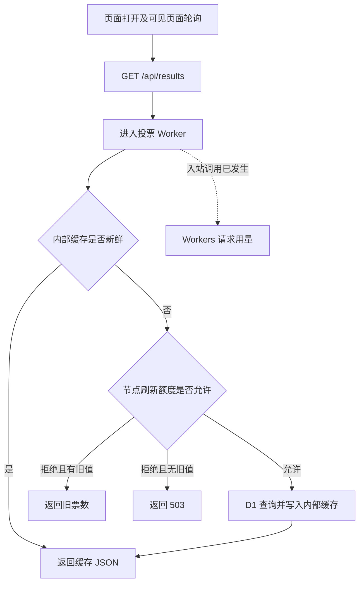
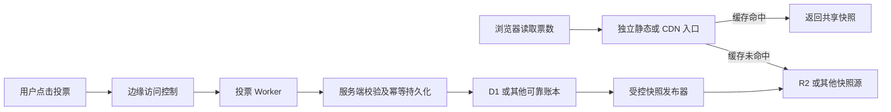

# 我一句话vibe的全网爆火的deepseek形象投票站如何让我3天亏掉近1000刀

前几天，我趁着 deepseek 男女拟人形象争论的浪潮，做了一个 deepseek 投票站 ds-vs-ds.win 可以说这个网站火遍了全网，我几乎可以在任何一个 qq 群 和社交网站上见到它的截图。

它内容很简单：两张deepseek拟人形象图，两个投票按钮，一条显示左右票数的进度条。页面实时更新票数。

在 vibe coding 这个网站之前，我几乎从未独立运维过如此巨大的流量规模的个人网站服务（我想 99.99% 的人会羡慕我这么大的流量）。

我 vibe 的时候，脑子里默认的场景是：几十个人看完，然后归于沉寂。所以我希望我的用户投票之后马上看到票数增长，而不是等 10秒，1分钟，我认为数据会刺激人类的神经，看着自己喜欢的形象票数越来越多，人的多巴胺会分泌。

为了快点上线，我省去了所有风险预判和处理措施。结果你看到了，10月4日我发现本月累计用量费已经接近 1000 刀。

这件事让我决定写下这篇复盘文章，并且制作了一个面向 cloudflare 场景下的支持一句话 vibe coding 的安全项目模板。当我想用一句话描述业务需求时，agent 可以参考仓库里的规则开发，默认把成本检查、账单报警和异常处理纳入交付，免去每次写大段 prompt 的麻烦。

你可以参考我整理的 [Cloudflare 成本审查 Skill](https://github.com/KurosawaGeeker/cloudflare-cost-playbook/blob/docs/cloudflare-cost-playbook/SKILL.md) 和 [AGENTS.md](https://github.com/KurosawaGeeker/cloudflare-cost-playbook/blob/docs/cloudflare-cost-playbook/AGENTS.md)。[原站脱敏源码与快照参考实现](https://github.com/KurosawaGeeker/ds-vs-ds-voting)也已经单独开源。

## 发现账单异常

这次账单异常，是连接了邮箱的 dots 主动检索邮件时发现的。

2026 年 10 月 4 日，我检查 Cloudflare 用量，看到了 $816.52 的累计费用。其中请求费占了 96.19%，达到 $785.40；CPU 费用只有 $31.12。我补充的截图显示请求费 $786.00、CPU 费 $31.14，合计 $817.14。

调查显示，账号账期内产生了约 26.3 亿次 Workers 请求，指定投票 Worker 在近七天承担了约 26.1 亿次调用。包含子域名在内的 Zone 七天 HTTP 请求数达到 2,677,103,137 次。其中 9 月 28 日至 30 日的三个 08:00 日界线高峰窗口，占了 Zone 七天请求的 97.36%。

## 一个极其简单的网站，该有生产护栏一个不能少

我最初的需求只是一个 GitHub Pages 的单页实时投票。

> 制作一个只有一个页面的投票站，站点极简，同时适配移动端和电脑端。实时展示当前投票结果。挂到我的 github.io 上。

后来，AI 助手引入了 Workers 和 D1 数据库，站点逐步迁到 Cloudflare。架构改变直接改变了成本结构：从托管静态网页，变成了运营一个全天候可调用的动态服务。

我曾向助手提问：

> 如果访问量巨大，我的账单会爆炸吗？

助手解释过请求费用及轮询放大效应，也设置了单次 CPU 限制。这些提醒停在了解释层面。引入动态后端、迁到 Cloudflare 时，助手应该重新评估成本，并落实预算、告警和处置措施；原始 prompt 里省略平台细节，不能成为跳过审查的理由。

单次 CPU 限制控制一次执行的计算量，整月请求费用仍会随调用数增长。

## 校验只保护了投票，没有保护主站请求

初版程序使用 localStorage 里的 UUID 去重。用户更换 UUID 就能重复投票。9 月 27 日早上，历史票数达到 4,559,229，D1 数据库因排队过载报错。

我随后要求助手增加护栏。我们部署了 Turnstile 人机校验、IP 限流、结果缓存与失败退避。旧票归档，页面展示从校验上线后重新计票。滚动一小时限流规则在第 11 票时拒绝写入，并持久封禁该 IP。IP 字段直到 9 月 30 日 20:30:46 才实际记录。

Turnstile 是 Cloudflare 的人机校验服务，绑定在投票流程上。服务端调用 Siteverify 校验令牌，通过后才写入新票。[服务端校验说明](https://developers.cloudflare.com/turnstile/get-started/server-side-validation/)

关键缺口在于：结果 API `GET /api/results` 无需投票验证令牌即可读取。页面初始化先获取结果，随后才加载投票验证。主站进站和公开读取缺少相应的前置访问控制。脚本可以直接请求这个接口，每次请求都可能增加 Worker 用量。

我把人机校验用在了加票环节，费用风险却暴露在人人都能读取的入口。

## 缓存与轮询的计费盲区

前端最初每 3 秒轮询一次。后来改为成功后约 5 秒，失败则按 10、20、40、60 秒退避，隐藏页面时停止发送请求。只要页面持续可见，正常访客也会不断产生请求。

服务端处理 `GET /api/results` 时，请求先进入 Worker，再检查内部的 `caches.default`。命中缓存确实减少了 D1 查询，但入站调用已经发生。

对外响应设置了 `no-store`，内部缓存新鲜窗口设为 10 秒，保留旧值的一天 TTL 用作故障降级。

### 改进前：读取票数先进入 Worker，内部缓存命中也计入调用用量。

Cache API 的内容按数据中心分布，节点之间各自保存缓存。平台还有名为 Workers Cache 的另一种能力，命中时可以免去脚本执行，仍按标准请求价计量。[Cache API](https://developers.cloudflare.com/workers/runtime-apis/cache/)、[Workers Cache](https://developers.cloudflare.com/workers/cache/)

主站静态 HTML 与动态结果 GET 走的是不同路径。请求进入 Worker，就会计入调用用量；即使命中缓存、跳过 SQL，或由 Worker 返回 403/429，这次调用已经发生。超过账号包含额度后，这些调用持续产生请求费。[Workers 定价](https://developers.cloudflare.com/workers/platform/pricing/)

下次我会先列出主域名、workers.dev、预览、dev 等全部公开入口。在支持 WAF（边缘防火墙）的域名上配置前置挑战和限流，其他入口关闭或另行控制，避免流量绕过主站规则。拦截是否发生在目标 Worker 之前，需要用安全事件和 Worker 调用指标一起验收。[WAF 处理阶段](https://developers.cloudflare.com/waf/feature-interoperability/)

首页的验证组件需要与 API 访问规则配合。Turnstile 预清除可以额外签发 `cf_clearance` Cookie，供相应 WAF 挑战识别已验证访客；这需要明确配置。通过校验的访客也可能高频请求，所以还要限流。只在 Worker 内验证后拒绝请求，入站调用仍然发生。[预清除说明](https://developers.cloudflare.com/cloudflare-challenges/concepts/clearance/)

## 只有一封告警邮件

我的 Gmail 仅收到一次 $10 的账单告警。之后再无该类告警，直到我打开 dots，dots 主动向我报警，遥想我前段时间狂喷 personal agent 方向，现在还是 personal agent 提醒了我埋藏在一堆广告里面的账单，成也 gpt 败也 gpt。

Cloudflare 的预算告警规则明确规定：**同一条预算提醒在同一账期跨过阈值时只发送一次**。[预算告警规则](https://developers.cloudflare.com/billing/manage/budget-alerts/)

这类提醒覆盖账号按用量收费的产品，固定订阅费需要另外核对。通知存在滞后，提醒本身只负责通知，用量仍会继续增长，并没有直接关闭服务的操作。[默认告警的范围和延迟](https://developers.cloudflare.com/changelog/post/2026-06-15-budget-alerts-default-on/)

**一定要做好账号级全局账单报警。**

Workers、D1、R2 等产品的费用最终会汇总到同一个账号。下次我会同时跟踪总费用和各产品用量，设定好阶梯式阈值，验证邮件实际送达，并主动复查费用增速。还要及时决定降频、拦截或停服。

运维 serverless 一定要快！

## 改进：转向快照与 CDN 分发

Cloudflare 把边缘计算和 CDN 放在同一个平台上，很容易让人以为“用了 Workers，就自动享受 CDN 缓存”。实际上，公开票数读取几乎没有享受到 CDN 缓存的分发作用。

在考虑计费的场景下，CDN 之于 worker 就相当于内存之于硬盘，redis 之于 sql。

我们知道 R2 出网流量免费；实际读取、写入和存储单独计费，而 cdn 的请求基本是不收费的。

以 26.1 亿次公开读取为例，假设账号对应月额度全部可用、每次回源只做一次 R2 读取，单算这条读取路径的请求或读取超额费：

- CDN 命中率 99%、其余 1% 回源 R2：R2 读取超额费约 **$6.12**。
- 全部进入 Worker：Worker 请求超额费约 **$780**。
- 全部直接回源 R2、缓存完全失效：R2 读取超额费约 **$936**。

这些是架构对比模型，尚未计入 CPU、发布器、投票写入及其他产品费用。[Workers 定价](https://developers.cloudflare.com/workers/platform/pricing/)、[R2 定价](https://developers.cloudflare.com/r2/pricing/)

改进架构如下

投票先经服务端验证并可靠保存；发布器再生成一份公开票数 JSON，覆盖写入 R2（对象存储）的固定文件。CDN（内容分发网络）直接把快照交给浏览器，读取路径避开投票 Worker。快照只放共享票数，个人投票标识和支付状态单独处理。

### 改进方案：公开读取由 CDN 分发快照，投票写入进入 Worker。

此图表示设计方向，尚未完成原站线上部署和计费验收。

这条公开读取路径需要明确的自定义域名和缓存规则，并避开 Worker 转发。缓存到期后，由后续请求触发回源；TTL 并不会让所有 CDN 节点定时主动读取。回源产生存储读取操作，投票和发布器仍有各自的计算、存储费用。

我们讨论过 15 秒发布、10 秒 TTL 的方案。Workers Cron 的调度精度是分钟级；秒级调度需要另选机制，例如 Durable Objects（集中协调状态的服务）的 alarm。投票应先可靠保存，再向用户确认成功。[Cron Triggers](https://developers.cloudflare.com/workers/configuration/cron-triggers/)、[Durable Objects alarms](https://developers.cloudflare.com/durable-objects/api/alarms/)

## 执行时间线与关键提示词

我把与事故有关的执行过程整理成了下面的时间线。调查时本地还有未提交修改，线上版本也没有与唯一 commit 完整对应，给还原历史增加了困难。下次每次发布都要留下提交、部署版本、时间和线上读回结果。

| 时间 (北京时间)        | 用户需求或发现                   | 执行结果与边界                                 |
| ---------------- | ------------------------- | --------------------------------------- |
| 9/27 00:42       | 创建实时单页投票站、先挂 GitHub Pages | 引入 Worker + D1；初版 UUID 去重、3 秒轮询         |
| 9/27 00:55–00:57 | 询问巨大访问量是否会产生高费用           | 解释请求单价和轮询；设置单次 CPU 限制；未完成总费用控制          |
| 9/27 09:59–10:07 | 四百多万票、结果读取经常失败            | 查到 UUID 漏洞与 D1 过载；部署校验、缓存、限流及退避         |
| 9/27 22:29–22:37 | 确认从人机校验上线后开始计票            | 旧票归档，展示切换；请求费用不撤销                       |
| 9/28 11:18       | 为广告合作获取真实访问数据             | 已发现百万请求；没有记录费用防护闭环上线                    |
| 9/30 16:04–20:30 | 保存 IP，一小时超十票封禁            | 本地准备及测试；到 20:30:46 生产新票才开始记录            |
| 10/4 16:53–17:01 | 查询流量和 Worker 账单           | 读到约 26.1 亿投票 Worker 调用，以及 $816.52 账号用量费 |
| 10/4 17:06 后     | 要求停服                      | 生产路由、默认和预览关闭；当时 dev 未完全移除               |

期间我给出的部分关键提示词：

> 今天一晚上过去已经 400 多万票了，是不是有刷票的，加个护栏吧，然后老是暂时无法获取票数。你修一下这个问题。

> 你先做一个根据 IP 地址的刷票行为 block，一小时之内刷了 10 张票以上的 IP 直接封掉。然后再检查一下人机校验有没有生效。

> 结合代码，账单，日志，给我输出一个长文报告，关于为什么我这个月账单这么贵，bug 原因，如何改进……给我一个事故报告。

## 案例数据表

以下是 2026 年 10 月 4 日调查读到的核心数值。账号账期是 2026 年 9 月 11 日至 10 月 10 日；指定 Worker 的近七天用量与域名统计分别列出：

| 指标              | 截至调查时读到的数值      | 口径                          |
| --------------- | --------------: | --------------------------- |
| 账号 Workers 请求   | 约 26.3 亿次       | 9/11–10/10 账期，截至 10/4；界面舍入值 |
| 投票 Worker 调用    | 约 26.1 亿次       | 近 7 天，指定服务；界面舍入值            |
| Zone HTTP 请求    | 2,677,103,137 次 | 9/27 08:00–10/4 08:00，包含子域名 |
| Workers 请求用量费   | $785.40         | 账号账期用量费，96.19%              |
| Workers CPU 用量费 | $31.12          | 账号账期用量费，3.81%               |
| 用量费合计           | **$816.52**     | 累计用量，不等于已确认扣款               |
| 已显示的 D1 超额用量费   | $0              | 不代表数据库没有过载过                 |

公开数字见 [案例数据](../evidence/case-facts.json)，调查依据及执行记录见 [证据说明](../evidence/case-notes.md)。

## 写给热爱 serverless 同时也在一个人做产品的你

做独立产品，最有诱惑力的时刻，就是一个想法突然能跑起来了。让 AI 写代码，接个域名，发条推文，2个小时就能把东西交到用户手上。我做这个投票站时，满脑子也是这些。

我愿意花时间调整按钮、换图、接广告，阻止刷票机器人，让我的投票站更公平公正，因为这些改动马上就能看到效果。账单报警、缓存路径、异常流量处理，可以一直拖到“有用户了再说”。结果流量真的来了，这些欠下的准备一定会反噬。

对 OPC、独立开发者和刚起步的创业者来说，serverless 的吸引力很实在：少管服务器，快速上线，流量增长时平台帮忙扩容。与此同时，费用也会随用量增长。一个人做产品，你的注意力是有限的，需要同时兼顾开发、推广和社交媒体互动，很容易忽视查账，运维这类枯燥无味的工作。

所以，下一次我再使用 cf 上线我的 vibecoding 网站前，我会先让 agent 回答四个问题：

1. **用户打开一次页面，会产生多少次付费调用？** 页面挂着十分钟、一小时，又会产生多少？轮询间隔也是成本参数。
2. **所有人看到的相同数据，能否交给 CDN 直接分发？** 要确认请求在哪一步命中缓存，以及命中后还会经过哪些收费服务。
3. **脚本持续请求时，在哪一步挡住它？** 投票校验保护写入，公开读取需要自己的保护；主域名、默认地址和测试域名都要检查。
4. **整个账号花到多少钱时，怎么通知我，我又能做什么？** 做好全局账单报警，确认提醒送达，主动复查费用，并准备能执行的降级、拦截和停服步骤。

这也是我把 [Skill 和 AGENTS.md](https://github.com/KurosawaGeeker/cloudflare-cost-playbook) 开源的原因。我很清楚，下次有了新点子，自己还是会想快点上线。把这些要求写进固定仓库模板，agent 就能在我只说一句业务需求时，把它们一起纳入开发和验收。

模板的价值，恰好体现在我最想省事的时候。

发推时，我们很喜欢分享“我用 AI 几小时做出了一个爆火的网站”。我想给这句话补上后半句：**也花一点时间，确认它突然火了之后，你的账单还扛得住。**
