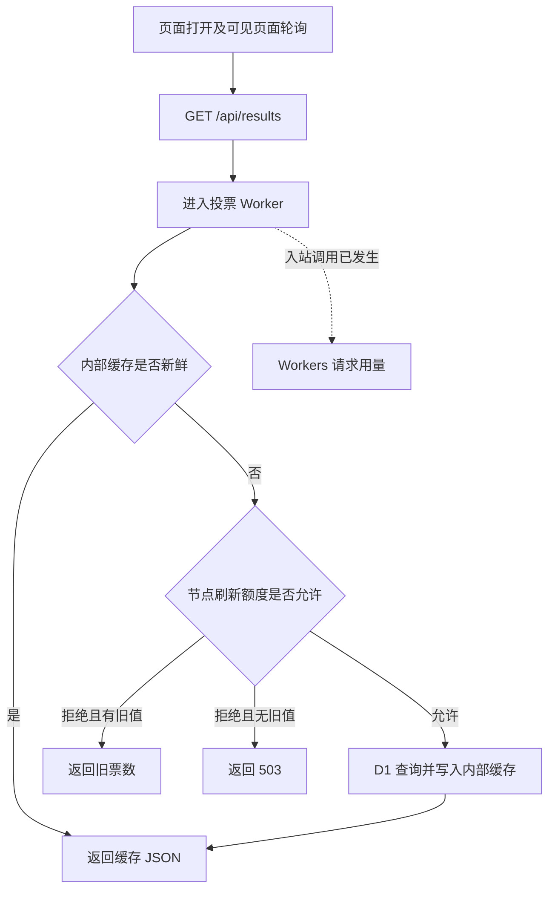
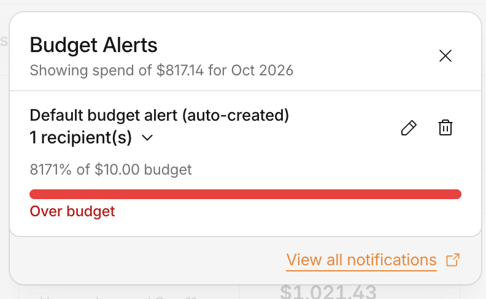
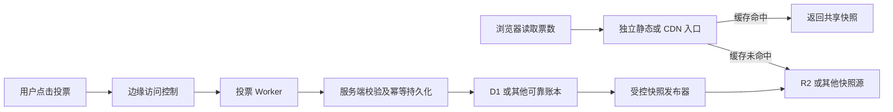

# 一个小投票站的 800 多美元费用：我踩过的 Cloudflare 成本坑

我的投票站很普通：两张图，两个按钮，一条显示左右票数的进度条。用户点一下，页面就更新票数。

在 vibe coding 这个网站的时候，我根本没想到它会火。我从未独立运维过这种流量规模的网站，总觉得它会和过去随手做的每个网站一样：几十个人看过，然后归于沉寂。

所以我偷懒了。为了快点上线，我没有提前准备好风险预判和处理措施。脑子里默认的场景是“先做出来，反正没几个人用”，没有认真想过：如果它突然火了，甚至被脚本反复请求，我该怎么办。

这件事让我意识到，**一定要有一个固定的、支持一句话 vibe coding 的仓库模板。** 这样，当我想偷懒、只想说一句业务需求时，agent 还能参考仓库里的规则开发，把成本检查、账单报警和异常处理纳入交付，不需要我每次都提前写一大段 prompt。

这对独立开发者和创业者尤其重要。我们选择 serverless，是为了降低运维压力、借助自动扩容快速验证 MVP；但自动扩容也意味着费用可以跟着请求一起增长。不能因为过去的项目没火，就一直把风险准备省掉。

这也是我决定输出这个 [Cloudflare 成本审查 Skill](https://github.com/KurosawaGeeker/cloudflare-cost-playbook/blob/docs/cloudflare-cost-playbook/SKILL.md) 和 [AGENTS.md](https://github.com/KurosawaGeeker/cloudflare-cost-playbook/blob/docs/cloudflare-cost-playbook/AGENTS.md) 的原因。[开源仓库](https://github.com/KurosawaGeeker/cloudflare-cost-playbook)把规则放在最上层，原站脱敏代码和新的参考实现放在 `examples/`。我想让下一次“先做出来”，也能带着这些检查一起开始。


上图是案例页面的展示截图；它没有完整拍摄时间，图中的票数不用于计算账单或访客量。

这次账单异常，是连接了邮箱的 dots 主动检索邮件时发现的。2026 年 10 月 4 日，我检查 Cloudflare 用量，看到了 **$816.52 的累计费用**。其中 $785.40 是 Workers 请求费，CPU 费用只有 $31.12。请求费占了 96.19%，数据库当时显示的超额费用是 $0。

我先说最核心的错误：票数请求每次都会先进入 Worker，再由 Worker 去查它内部的缓存。缓存确实减少了数据库 D1 的查询，但请求每次进入 Worker 都会计入调用量。

当时我的印象一直是“请求一般很便宜，Cloudflare 的请求不花钱”。我没有给公开读取入口做好前置保护，也不想让每个人进站都先过一次人机验证。没想到流量上来之后，各种来源的请求数以亿计，远远超出本案例 Workers Standard 套餐**每月 1,000 万次请求的包含额度**，超额调用持续产生费用。[Workers 官方定价](https://developers.cloudflare.com/workers/platform/pricing/)

所以“少查数据库”不等于“少调用 Worker”，更不等于“少花钱”。我当初没有把调用次数管住，缓存做了、验证码加了、失败退避也写了，费用依然失控。

这也是我最想留给独立开发者的教训：**功能简单，不代表费用风险小。**如果你用 AI 做网站，除了问它“功能做好了吗”，还要让它说清楚：用户每点一次、页面每刷新一次，究竟会调用什么，按什么收费。

## 1. 我想做一个网页，最后运营了一个动态服务

我最初没有要求使用 Cloudflare。我给 AI 编程助手的需求是一个极简、适配手机和电脑的实时投票页，先部署到 GitHub Pages。GitHub Pages 能放静态页面，但所有人都要看到同一份会变化的票数，就得有一个共享后端。助手把方案扩展成 Worker API 加 D1 数据库，随后我注册了自定义域名，站点逐步迁到 Cloudflare，原 GitHub Pages 入口也关闭了。这里的性质已经变了：从托管网页，变成运营一个全天候可调用的动态服务。页面看起来还是那么小，费用结构却完全不同。

当时我的提示词是：

> 制作一个只有一个页面的投票站，站点极简，同时适配移动端和电脑端。实时展示当前投票结果。挂到我的 github.io 上。

这个后端里，Worker 是托管在 Cloudflare 上的程序，用来接收请求、处理投票和返回结果；D1 是保存票数的数据库。Cloudflare 帮我运行程序，但费用要按请求、CPU 和数据库等产品各自的规则计算。

对习惯 VPS 的开发者来说，这一步很容易低估。页面还是原来那个页面，后端却不再只是租一台机器后关注它能不能扛住：每一次调用都可能增加计费用量。

我很早就问过：

> 如果访问量巨大，我的账单会爆炸吗？

助手当时解释过 Workers 按请求的超额单价、轮询会把请求放大、单次 50 ms CPU 上限不等于月账单硬上限。我不能把历史改写成它没提醒过我。真正的缺口是：提醒没有变成预算、告警和停服动作。

## 2. 我们先解决了刷票，却没有一起解决费用问题

第一次出问题是刷票。初版用浏览器 localStorage 里的 UUID 作为投票标识，数据库保证同一个 UUID 只计一票。问题是 UUID 可以随便换，换一个就能再投。9 月 27 日早上，历史票数已经到 4,559,229，D1 也报过 `7429: D1 DB is overloaded. Requests queued for too long.`。投票标识可以被绕过，数据库也出现了过载。报错的意思是：数据库忙不过来，请求排队太久。后来陆续加了人机校验、投票限流、结果缓存、失败退避和 IP 记录。旧票也按我确认的口径归档，展示的计票起点切换到人机校验上线之后。Turnstile 是 Cloudflare 的人机校验服务。我们的后端会调用 Siteverify，向平台确认验证令牌是否有效，并检查 `success`、`hostname`、`action` 和用户标识；配置缺失、令牌缺失或校验失败时，都不写入新票。后来加入的滚动一小时十票规则，只限制新投票：第十一票被拒并进持久封禁名单，不是一小时后自动解封。IP 字段从 9 月 30 日 20:30:46 才开始实际记录，之前的票没法追溯补上。

[服务端验证令牌的官方说明](https://developers.cloudflare.com/turnstile/get-started/server-side-validation/)解释了为什么后端必须确认校验结果，不能只看页面上出现了一个验证组件。

但费用问题的入口不在写票，而在读票。投票写和结果读是两条路。服务端增加了投票护栏，结果读取仍然可以被反复请求。哪怕每次都不执行 SQL、只返回缓存，Worker 入站调用已经发生。封禁名单只用于新投票，并没有覆盖公开的结果读取接口。清掉旧票，也撤销不了已经发生的请求费用。

早期异常票主要出现在 9 月 27 日上午，请求费用的流量高峰则集中在 9 月 28 日至 30 日。两件事都需要调查，但不能拿票数去解释请求量，更不能把两次问题当成已经一起修复。

轮询把正常访问也放大了。初版每 3 秒读一次结果；后来改成成功后约 5 秒读一次，失败按 10、20、40、60 秒退避，页面隐藏时暂停。没有证据表明存在零间隔死循环。但即便一个用户安安静静开着页面，按 5 秒间隔算，一天就是 17,280 次请求，30 天超过 51 万次。这个数字是单个持续可见页面的模型，不是真实访客数。它说明的是：只要前端用轮询做“实时”，页面只要持续可见，就会不断向后端发请求。直接打接口的脚本更不会遵守你写在 JS 里的退避逻辑。

```text
结果请求 ≈ 页面打开时首次读取
         + 可见停留秒数 ÷ 轮询间隔
         + 恢复可见、投票等事件触发的读取
```

页面刚打开时会读一次票数，之后定时再读；恢复可见、投票等事件也会触发读取。用户看几秒就关掉，请求很少。长期打开、多开标签页，调用就会累积。

假设页面连续可见 30 天，所有结果读取都计入 Worker 调用，账号每月 1,000 万次包含额度全部留给这里，单算请求超额费：

| 持续可见页面数 | 30 天结果请求 | 请求超额费模型 |
|---|---:|---:|
| 10 | 5,184,000 | $0 |
| 100 | 51,840,000 | $12.55 |
| 1,000 | 518,400,000 | $152.52 |
| 5,000 | 2,592,000,000 | $774.60 |

这不是在说本次流量就来自 5,000 个用户。我用这个模型，是为了让“实时更新”有一个能事先计算的成本。把轮询改慢，能减少正常页面的请求；直接请求接口的脚本不会遵守前端的间隔和退避。

## 3. 缓存省下了数据库查询，却没省下 Worker 调用

浏览器获取票数时，请求的是 `GET /api/results`。这条请求先进入 Worker，Worker 再检查内部缓存 `caches.default`。有新鲜缓存就直接返回，没有才考虑查询 D1。数据库因此轻松了，但请求已经进入了 Worker。

可以把两笔费用分开看：数据库少查一次，节省的是数据库操作；Worker 少被调用一次，减少的才是 Worker 请求用量。我们的缓存放在程序内部，所以只做到了前一件事。



下面这段简化代码能看出关键顺序：检查缓存之前，请求已经调用了 Worker。

```js
async function readResults(url, env) {
  // 运行到这里，请求已经进入 Worker。
  const key = new Request(`${url.origin}/__public_totals_vX`);
  const cached = await caches.default.match(key);

  if (cached && isFresh(cached, 10_000)) {
    return publicJson(await cached.json()); // 不查询 D1。
  }

  // 这个额度限制刷新数据库的次数，不限制所有入站调用。
  const allowed = await env.RESULTS_REFRESH.limit({ key: "totals" });
  if (!allowed.success) return staleOrUnavailable(cached);
  return refreshFromDatabase(env);
}
```

这个缓存还存在于各个数据中心内部，不会自动复制到所有节点。即使用了同一个固定键，也不能保证全球只有一次数据库刷新，更不能把它当成一把全球锁。[Cache API 官方说明](https://developers.cloudflare.com/workers/runtime-apis/cache/)

另一个配置细节是，对外响应用了 `Cache-Control: no-store`，浏览器 `fetch` 也选择了 `no-store`。内部缓存的一天 TTL 用来保留旧票数以便故障时返回；10 秒则是判断票数是否需要刷新的新鲜窗口。它们并没有让外部 CDN 自动每 10 秒只查一次数据库。

CDN 是把内容缓存到各地节点、就近交给用户的分发网络。它可以正常分发静态页面，但票数 API 仍可能调用动态程序。所以这次的问题不能概括为“CDN 失效了”：网页和票数走的是两条不同路径。

Cloudflare 里还有名称接近、作用不同的缓存能力，选型时要分清：

| 缓存的位置 | 能减少什么 | 仍需核对什么 |
|---|---|---|
| Worker 内部 Cache API | SQL、部分 CPU 和等待 | Worker 入站调用仍发生 |
| 平台 Workers Cache | 命中时可以减少脚本执行 | 官方仍按标准 Worker 请求价计量 |
| 不经过该 Worker 的静态/CDN 路径 | 可以避免这个 Worker 的入站调用 | 静态服务、回源及存储操作费用 |

尤其是平台提供的 Workers Cache：命中时能减少脚本执行，但官方仍按标准 Worker 请求价计量。换一种缓存，不会自动把读取请求费归零。[Workers Cache 官方说明](https://developers.cloudflare.com/workers/cache/)

这里也回答了“打开网页就弹验证码，能不能解决”的问题。只在前端挡住页面，脚本可以绕过网页直接请求 API；如果后端 Worker 自己验证失败再拒绝，请求也已经进入了程序。

要减少这类调用费用，需要验证拦截发生在目标 Worker 之前。WAF 是 Cloudflare 在请求处理过程中执行的安全规则；某些终止型动作能停止后续处理，但具体规则是否保护到了我们的入口，必须实际检查。[WAF 处理阶段](https://developers.cloudflare.com/waf/feature-interoperability/)

光看到一个 403 或 429 不够，因为它也可能是 Worker 自己返回的。测试时要同时看安全规则事件和 Worker 调用数，确认拒绝请求没有进入目标程序。

还要列出主域名、Worker 默认域名、预览链接、dev 和备用域名。本案例绑定主站后，一度还保留着默认入口。主站的安全规则不能被想当然地认为覆盖了所有其他入口。测试服务还配置过 `run_worker_first`，静态文件也可能先执行 Worker；最后返回的是静态文件，并不代表中间没有动态调用。[Static Assets 计费说明](https://developers.cloudflare.com/workers/static-assets/billing-and-limitations/)

## 4. 我只收到了一封 $10 告警，然后就没有然后了

**一定要做好全局账单报警。**不能只盯单次调用花了多少 CPU，也不能只看某一个 Worker 或某一种存储。我们最终要付的是账号上各项费用加起来的账单。

我的 Gmail 只收到过一次 $10 阈值的账单告警，之后再也没收到其他账单告警。直到连接邮箱的 dots 主动检索邮件，才发现这次问题。dots 在这里的作用，是帮我主动查看邮件，而不是等新的通知自己出现。

补充截图中，默认预算告警的阈值是 $10，配置了一个接收者，面板用量支出已达到 $817.14，约为预算的 81.7 倍。界面显示 8171%、Over budget。**$10 是提醒阈值，不是费用上限，也不是自动停服线。**



Cloudflare 官方说明，同一条 Budget Alerts（预算告警）在同一个账期跨过指定金额时，只发送一次邮件，下个账期才重置。费用继续从 $10 涨到 $100、$500、$800，并不会让同一条提醒不断重发。[预算告警规则](https://developers.cloudflare.com/billing/manage/budget-alerts/)

因此，我只收到一次邮件，与这个机制相容，不能据此断言平台漏发。但如果运营者以为“继续超支就会继续通知”，只设一条默认提醒，就很容易在第一次提醒之后失去后续跟进。

这个提醒汇总的是账号上按用量收费产品的费用，不包括 Workers Paid 等固定订阅费。用量按天处理，通知也会晚于实际活动。它只提醒，不限制用量。[默认告警的范围和延迟](https://developers.cloudflare.com/changelog/post/2026-06-15-budget-alerts-default-on/)

下次我会同时做这些事：

- 设置账号总预算，聚合 Workers、D1、R2、DO 等用量费用，另外核对固定订阅费；产品分项监控用来定位增长来自哪里。
- 按自己能承担的金额设置多级阈值，并主动检查费用增长速度。一次跨过多条线也不保证收到多封邮件；持续催办、每日摘要需要另外实现。
- 验证提醒能否真正送达，核对接收者、垃圾邮件和通知规则，并明确多久必须确认和处理。一个人运营，也要有自己执行的流程。
- 主动查看账单和请求指标，而不是只依赖邮箱里的一封邮件。dots 这次补上了发现问题的环节，但主动查账也应该成为日常措施。
- 提前准备降频、只读快照、请求拦截和停服动作。统计、检测、配置传播和在途请求都有延迟，不能把这套保护叫作绝对的月费硬上限。

控制台已经红了，不代表程序已经停止产生费用。报警的价值，最终取决于收到之后会做什么。

## 5. 如果重新做，我会把读票数变成读一份共享文件

如果重新设计，我会把“读结果”从动态程序里拿出来。所有人的票数基本相同，不需要每次读取都执行代码和 SQL。可以让一个受控的发布器读取可靠数据，生成一份固定路径的快照文件，放到 R2 公共桶，由 CDN 直接分发。用户打开页面读快照，不再调用投票 Worker；用户点击投票时，才调用动态写入程序。公开读取的费用则要看静态分发和存储回源。R2 的固定对象名可以反复覆盖，不需要每个版本留一个对象，但要防止旧写入覆盖新写入。投票处理程序必须先把票保存成功，再向用户确认成功，不能把票先攒在普通 Worker 内存里再指望它自己刷下去。“15 秒发布一次、TTL 设 10 秒”是我们讨论过的方向，但它只是方案，本地模板没有证明原站线上费用已经降低。

R2 是 Cloudflare 的对象存储，可以保存这样的 JSON 文件。数据库仍负责可靠记票，发布器定期读取结果、更新这一个文件。分发票数和处理投票各做各的事，不再让所有人每次读取都进同一个动态接口。



这里有几个实现细节不能省略。用户是否投过票、个人标识和支付状态不能混进公开快照。发布失败时可以保留带时间戳的旧结果，让页面解释票数暂未更新。

R2 要用明确的自定义域名和缓存规则；JSON 不会因为放进桶里，就必然被 CDN 缓存。若仍让 Worker 转发文件，Worker 入站调用还在。分层缓存可以减少回源，效果要看实际存储操作数。[R2 公共桶与缓存](https://developers.cloudflare.com/r2/buckets/public-buckets/)

TTL 表示缓存能保留多久。通常是缓存到期后，下一次请求触发刷新，不是全球节点每隔 10 秒主动来拿文件。发布间隔、CDN 缓存时间和浏览器轮询都会影响用户看到的延迟。

固定对象名反复覆盖，不需要每个版本都留一个对象，但更新必须有顺序，不能让迟到的旧写入覆盖新结果。单发布者、序列化更新和失败恢复要有实现与测试。

我们讨论过每 15 秒发布一次、缓存 10 秒的方案。Workers Cron（定时任务）使用分钟级表达式，秒级发布要另选机制，例如 Durable Objects 的 alarm（定时唤醒）。不能只改一个数字就声称做到了。[Cron Triggers](https://developers.cloudflare.com/workers/configuration/cron-triggers/)、[Durable Objects alarms](https://developers.cloudflare.com/durable-objects/api/alarms/)

Durable Objects，简称 DO，是用来集中协调状态的一种服务，可以评估它来做实时推送或秒级调度。原站的公开票数没有使用 DO，它也不是自动免费的全球内存缓存：请求、活动时长和存储有自己的费用，调用它的 Worker 还可能另计费用。能接受几十秒或分钟级更新时，更简单的发布器也可能够用。[DO 官方定价](https://developers.cloudflare.com/durable-objects/platform/pricing/)

### 换一条读取路径，也要算缓存失效的账

用相同的 26.1 亿次公开 GET 做模型，假设使用 R2 Standard、当月读取包含额度全都可用，每次实际回源对应一个 Class B 读取操作，估算如下。这里没有把七天流量外推成整月。

| 最终没有到 R2 的读取比例 | R2 回源操作 | R2 读取超额费 |
|---|---:|---:|
| 99.9% | 2,610,000 | $0 |
| 99.5% | 13,050,000 | $1.44 |
| 99% | 26,100,000 | $6.12 |
| 95% | 130,500,000 | $43.56 |
| 0%，缓存完全失效 | 2,610,000,000 | **$936** |

R2 每月包含 1,000 万次读取，超额每百万次 $0.36；超额操作按计费单位向上取整。所以 99% 那行是 $6.12。表里的比例包含分层缓存消化的请求，不等于单个浏览器看到的 `CF-Cache-Status` 命中率。[R2 官方定价](https://developers.cloudflare.com/r2/pricing/)

如果 CDN 完全没缓存住，26.1 亿次请求都去读 R2，读取费用可能达到 **$936**，反而比原来的请求模型更贵。R2 不是一换上去就便宜，关键是有多少请求真的被缓存消化了。旧 Worker 内部缓存的命中率，不能用作新路径的预期命中率。

每 15 秒覆盖一次快照，30 天约 172,800 次写入，少于 100 万次月度写入包含额度，文件存储量也很小。但投票 POST、数据库、发布器、订阅和其他服务仍要分别算钱。

以上是改进方案。本仓库模板提供了本地示例，但没有恢复原站，也没有证明原站线上费用已经降低。换存储、测通接口、通过本地测试，都不能替代部署后观察实际调用量和回源操作。

## 6. 这不能归咎于第一个 prompt 少写了一句话

回头看 AI 助手。原始提示词没写 Cloudflare，这不是推卸责任的理由。引入动态后端、迁到 Cloudflare，都是架构决定，需要重新评估成本。用户不需要先知道“Worker 缓存命中仍计调用”才能做一个投票站。助手做过有效工作：解释过费用、修过刷票、部署过 Turnstile 和 D1 降载、保留了归档记录，最后也执行了停服及检查。但它没有把“按调用计费”这个提醒变成可执行的预算、告警与处置流程，也没有在发现流量异常后立即转向费用事故响应。调查时本地工作区还有未提交修改，线上版本标识也没有和唯一 commit 完全对齐，这让我后来精确还原线上行为更难。功能测试过了，不代表高峰期线上跑的就是同一份代码。

后来我还让助手修改广告、支付和页面布局，这些迭代也不能成为费用控制没有完成的理由。一个普通开发者不需要先掌握 Cloudflare 的全部细节，才有资格提出实时投票的需求。

这次实施上的缺口很具体：没有确定可承担的日/月预算，没有验证公开读取会花多少钱，没有把异常流量报告及时转为费用处理，也没有把所有公开入口的拦截和降级测试做完。源码、提交、线上版本和测试时间也没有持续对应好。

我把与事故有关的执行过程整理成了下面的时间线。时间均为北京时间，完整密钥、原始 IP 和身份资料不在公开材料里。

| 时间 | 用户需求或发现 | 公开执行结果与边界 |
|---|---|---|
| 9/27 00:42 | 创建实时单页投票站、先挂 GitHub Pages | 引入 Worker + D1 后端；初版 UUID 去重、3 秒轮询 |
| 9/27 00:55–00:57 | 询问巨大访问量是否会产生高费用 | 解释请求单价和轮询；设置单次 CPU 限制；未完成总费用控制 |
| 9/27 09:59–10:07 | 四百多万票、结果读取经常失败 | 查到 UUID 漏洞与 D1 过载；部署校验、缓存、限流及退避 |
| 9/27 22:29–22:37 | 确认从人机校验上线后开始计票 | 旧票归档，展示计票口径切换并读回；请求费用不撤销 |
| 9/28 11:18 | 为广告合作获取真实访问数据 | 已发现百万请求和程序化征兆；没有记录费用防护闭环上线 |
| 9/30 16:04–20:30 | 保存 IP，一小时超十票封禁 | 本地准备及测试，授权曾阻塞；到 20:30:46 生产新票才开始记录 |
| 10/4 16:53–17:01 | 查询流量和 Worker 账单 | 读到约 26.1 亿投票 Worker 调用，以及 $816.52 账号用量费 |
| 10/4 17:06 后 | 要求停服 | 生产路由、默认和预览入口关闭，回读主站/API 403、默认入口 404；当时 dev 未完全移除 |

其中几次请求，我说得很直接：

> 今天一晚上过去已经 400 多万票了，是不是有刷票的，加个护栏吧，然后老是暂时无法获取票数。你修一下这个问题。

> 你先做一个根据 IP 地址的刷票行为 block，一小时之内刷了 10 张票以上的 IP 直接封掉。然后再检查一下人机校验有没有生效。

> 结合代码，账单，日志，给我输出一个长文报告，关于为什么我这个月账单这么贵，bug 原因，如何改进……给我一个事故报告。

执行记录里有数据库错误、部署结果、归档后的票数、IP 字段上线后的记录，以及停服后的 HTTP 响应。这些是判断完成情况的依据。助手说“做好了”、本地写好了、已经提交、已经部署、线上验证通过，是不同的状态，不能互相代替。

## 7. 下次上线前，我会要求这些检查结果

对独立开发者来说，不必先成为云平台专家，但可以要求助手把成本讲到能复核的程度：正常用户会产生多少调用，异常流量来了会增加多少钱，哪个措施能减少哪一项费用，以及什么时候由谁来处理。

| 验收项 | 需要看到的证据 | 不能替代它的东西 |
|---|---|---|
| 每个请求在哪里计费 | 路径图、路由配置、产品费用维度 | 页面看起来很轻 |
| 正常流量成本 | 停留时长、轮询、标签页和账户共享额度模型 | 只报“单次很便宜” |
| 异常流量成本 | 峰值请求预算、统计/响应延迟和降级机制 | 只设 CPU 上限 |
| 缓存解决了哪项费用 | Worker 调用、数据库操作、回源分别对照 | 一个很高的命中率 |
| 读取不经过动态 Worker | 受控请求窗口与目标 Worker 指标 | JSON 返回 200 |
| 边缘拦截确实生效 | 规则事件、被拦样本与 Worker 调用对照 | Worker 返回 403/429 |
| 全局账单告警能用 | 账号跨产品费用、分级阈值、实际送达、主动复查、负责人和处置演练 | 单次调用限制、分项提醒或控制台有一条配置 |
| 所有入口受控 | 主站、默认、预览、dev、备用域名清单 | 主域名测试成功 |
| 发布可以复查 | commit、构建哈希、部署版本、时间及读回 | 本地测试通过 |
| 停服范围明确 | 各入口关闭读回、后续新增用量观察 | 仅改了一份配置 |

测试使用经过授权的小样本，不要为了证明防护有效，再往线上制造一轮昂贵请求。检测和执行有延迟，自动停服也需要权限和配置传播时间。

我会把下面这段要求放进项目启动说明：

> 涉及公开接口、轮询、推送或云服务选型时，先说明请求、计算、存储和日志怎么计费，给出正常与异常流量成本模型。缓存验收必须区分减少程序调用、减少 SQL 和减少回源。列出全部公开入口，验证异常请求在目标收费程序之前被阻止。做好账号级全局账单报警，明确覆盖的费用、分级阈值、送达验证、主动巡检、负责人、降级机制和延迟。每次交付分别列出本地完成、已提交、已部署、线上验证，以及仍未完成的部分。

同仓库的 Skill 把这些要求展开成审查流程，AGENTS.md 给出能复制的短规则，项目模板提供读写分离的本地示例。实际采用哪种方案，要看业务能接受的延迟和预算，不是每个项目都必须用 R2 或 DO。

这次让我把三件事分开看：票能不能被乱加，数据库能不能扛住，请求费用能不能控制。验证码、数据库缓存和本地测试分别解决一部分问题；29 项本地测试通过，也不能证明线上费用已经受控。

Cloudflare 可以做投票业务，问题在于程序、缓存和收费路径怎么组合。用 AI 开发，也应该要求它同时交付功能设计和成本设计。识别了风险之后，把风险变成可以执行和检查的措施，才算完成。

## 数据与来源

事实截至北京时间 2026 年 10 月 4 日。原始调查的账号账期是 9 月 11 日至 10 月 10 日，累计用量费为 $816.52。补充截图中，请求费 $786.00 加 CPU 费 $31.14，合计 $817.14。两份观测分别保留；截图没有完整拍摄时间，不能用来推算两次观测的先后或差额发生时间。这些用量观测不是已核实的最终发票或扣款。


图 1：所有者提供的费用明细原图。界面总用量与可计费用量为舍入值。预算截图中的「Oct 2026」只是一份面板标签，不能替代已经核对的完整账期。

调查使用了控制台、域名 Analytics、Worker 指标和抽样日志、本地代码、Git 历史及会话执行结果。账号、指定 Worker 和域名 Zone（域名及其子域名的统计范围）的数字不能混用：

| 指标 | 截至调查时读到的数值 | 口径 |
|---|---:|---|
| 账号 Workers 请求 | 约 26.3 亿次 | 9/11–10/10 账期，截至 10/4；界面舍入值 |
| 投票 Worker 调用 | 约 26.1 亿次 | 近 7 天，指定服务；界面舍入值 |
| Zone HTTP 请求 | 2,677,103,137 次 | 9/27 08:00–10/4 08:00，包含子域名 |
| Workers 请求用量费 | $785.40 | 账号账期用量费，96.19% |
| Workers CPU 用量费 | $31.12 | 账号账期用量费，3.81% |
| 用量费合计 | **$816.52** | 累计用量，不等于已确认扣款 |
| 已显示的 D1 超额用量费 | $0 | 不代表数据库没有过载过 |

核验时 Workers Standard 超额请求价为每百万次 $0.30，CPU 超额价为每百万毫秒 $0.02，另有最低订阅费用。包含额度按账号计算，不能给每个 Worker 分别减一份。[Workers 官方定价](https://developers.cloudflare.com/workers/platform/pricing/)

从请求费反推超额调用：

```text
$785.40 ÷ $0.30 × 1,000,000
= 2,618,000,000 次超额请求
```

域名统计中，9 月 28 日至 30 日的三个高峰窗口占七天请求的 97.36%。这里的日界线是北京时间 08:00，范围包含子域名：

| 北京时间窗口 | Zone HTTP 请求数 | 全天平均请求/秒 |
|---|---:|---:|
| 9/27 08:00–9/28 08:00 | 4,755,212 | 55.04 |
| 9/28 08:00–9/29 08:00 | 797,131,326 | 9,226.06 |
| 9/29 08:00–9/30 08:00 | 1,118,612,190 | 12,946.90 |
| 9/30 08:00–10/1 08:00 | 690,714,081 | 7,994.38 |
| 10/1 08:00–10/2 08:00 | 18,327,112 | 212.12 |
| 10/2 08:00–10/3 08:00 | 177,875 | 2.06 |
| 10/3 08:00–10/4 08:00 | 47,385,341 | 548.44 |

这些数据说明请求规模异常，不能证明全部由机器人、正常轮询或同一个 IP 产生。请求不是访客，也不是成功投票；原始 PV、唯一 IP 参考值不能直接拿去向广告商承诺真人曝光。

Gmail 收件和 dots 发现问题的经过是作者的亲身陈述，公开包没有独立核验原始邮件或投递日志。生产服务已经执行停服，但最终账单、测试入口的持续状态和跨日新增费用仍需另外核对。

公开数字见 [案例数据](../evidence/case-facts.json)，调查依据及执行记录见 [证据说明](../evidence/case-notes.md)。官方资料核验日期是 2026-10-04，价格、套餐权益和产品能力可能变化，部署前要重新核对。
